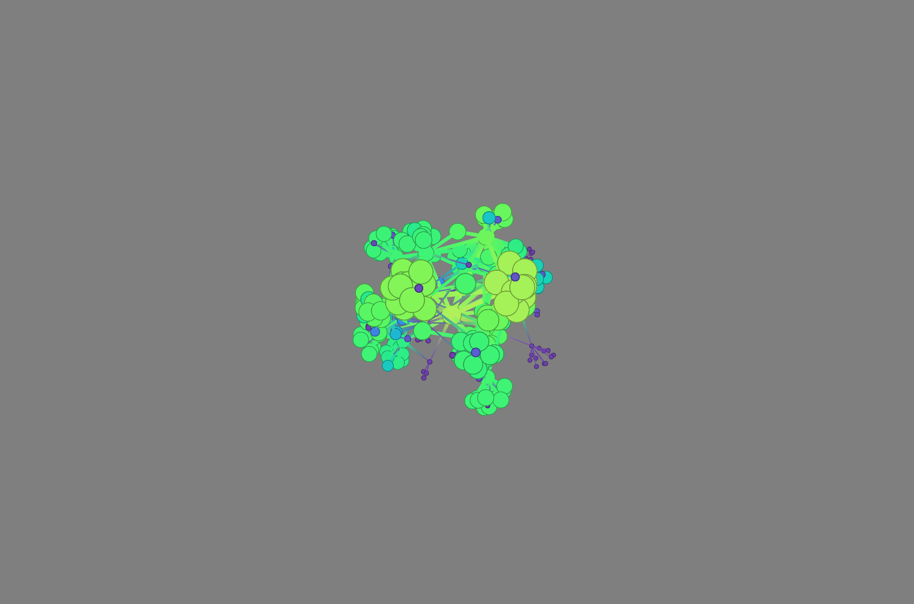
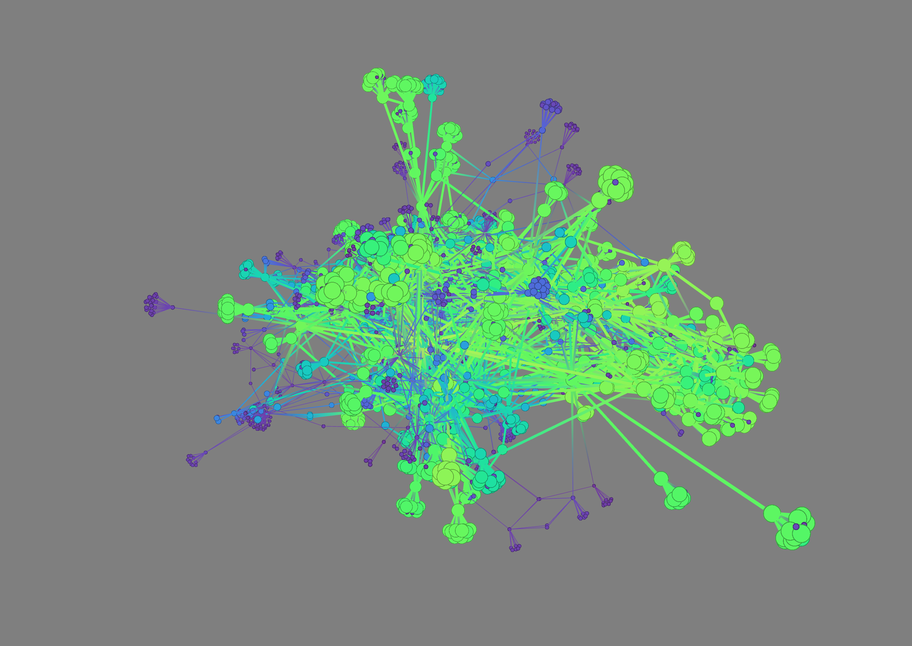

# Independent Study: Recommending Papers based on similarity metrics
This repo contains my work for an independent study as my capstone course for a master's in data science from Indiana University. 

## The Why
Throughout the course of completing my masters degree, there were many times I found myself reading a piece of research that I didn't fully understand. Data science is a very rapidly evolving field, and due to this it can be difficult to keep up. As I encountered this issue more and more I began to wonder why there weren't more tools out there to help facilitate filling in knowledge gaps (Research Rabbit looks promising, but also pretty new). So with the backing of Professor [Yong Yeol Ahn](https://luddy.indiana.edu/contact/profile/?Yong~Yeol_Ahn) from IU's Luddy School and [Filipi Silva](https://iuni.iu.edu/about/people/person/filipisilva) from IU's Network Science Institute as advisors I decided to try and tackle the problem on my own.

This application allows a user to input the title of a paper they plan on reading, and then collects the references from the paper to a depth of `n`. From there, it calculates two similarity scores: weight and root_weight. Weight is the similarity score between a `source` paper and it's parent, or the paper `target`. Root_weight is always between the paper at hand and the initial paper given.

From there we average out these two scores and use it to determine the size of nodes and create a 3d graph visualizing the relationship between the papers. The root node will always have a size of 1, while each other paper will use the `average weight * size` of the node representing the paper(s) that referenced it. The resulting visualization can be seen below with a depth of 3 and a depth of 4 respectively. The default for the application is 3 as it seems the most useful in terms of usability. For more details on features and how to use the tool, check out this [video](https://youtu.be/9nINe_z7_zU).

### Depth = 3

### Depth = 4

## Tech Stack
* Backend: Python's FastAPI
* Frontend: Javascript and Helios-web
* PyTorch, OAG-Bert, and Milvus for creating and storing embeddings.

## Local Setup: Milvus
In order to get a local standalone version of Milvus up and running, run the following docker-compose command:

`docker-compose -f ./docker/docker-compose.milvus.yml up`

Then to shut the servers down simply run the following:

`docker-compose -f ./docker/docker-compose.milvus.yml down`

## Local Setup: Web App
To run the webserver, you'll need python 3.6+ installed, and to install the `requirements.txt` file. This can be done with the following command:

`pip install -r requirements.txt`

If you have an nvidia gpu however, you can instead install the `requirements-nvidia.txt` file to benefit from gpu acceleration:
`pip install -r requirements-nvidia.txt`

To run the web app, run the following command from the backend folder:

`python main.py`

You can then interact with the application at http://0.0.0.0:8080/. To shut down the server use `Ctrl + C`.

